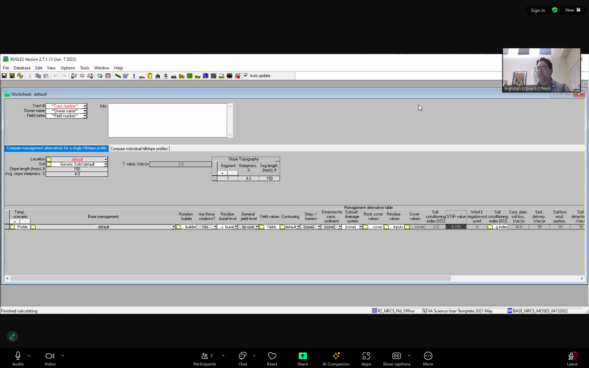

# Report Jun 17 - 21

> Author: Haolin Li
>
> GitHub Repository: https://github.com/HumblePasty/EDF_Proj
>
> Data Update EDF Project

## Crop Parts Decision for GraceNET

This is the list of the measured parts for different crops for GRACENET. As discussed we might need to decide which parts to be used for carbon input calculation for each type of crop. I bolded the parts I think should be included. Some crop types (for example rangeland and prairie) seems to be control experiments and should maybe excluded.

- Glycine max  (Soybean)
  - **Grain**
  - leaves
  - pod
  - **roots**
  - stems
  - **Whole plant (above  and belowground biomass)**
- Gossypium hirsutum  (Cotton)
  - **Whole plant (above  and belowground biomass)**
- Medicago sativa  (Alfalfa)
  - ==keep in mind there might be multiple times==
  - **Aboveground Biomass**
  - **Roots**

- *Rangeland (ignore)*
  - *0-5 cm roots*
  - *5-10*
  - *10-20*
  - *20-30*
- Restored Prairie
  - Whole plant (above  and belowground biomass)
- Secale cereale  (Winter Rye)
  - **Aboveground Biomass**
- Sorghum bicolor  (Grain Sorghum)
  - Whole plant (above  and belowground biomass)
- Sorghum bicolor X  Sorghum sudanens (Haygrazer)
  - Whole plant (above  and belowground biomass)
- Sorghum vulgare  sudanense (Sudangrass)
  - Whole plant (above  and belowground biomass)
- Triticum aestivum  (Wheat)
  - **Grain**
  - **Roots**
  - **Use Bolinder to estimate vegetative**
- Corn
  - Above earshank
  - Above earshank leaves
  - Above earshank stems
  - Aboveground Biomass
  - Below earshank
  - Below earshank leaves
  - Below earshank stems
  - Cobs
  - Cobs and grain
  - Ear leaf
  - **Grain**
  - Husk
  - Leaves
  - **Roots**
  - Sheath
  - Stems
  - Stems and leaves
  - **Stover (all non-grain biomass)**
  - Tassel

## Aggregating GHG emissions into annual rows

I attached in the email two CSV files indicating plots from CAP and GRACENET, their identifiers, number of measure records for GHG emission, and start and end date.

cap_gas_emission_identifiers.csv

gracenet_gas_emission_identity.csv

I think Dr. Blesh mentioned we should make decisions on how to aggregate the data into annual data. One method I can think of is that we a start

- start date
- end date
- number of measurement within the time range
- identifiers + 

## Tillage

I think I didn't get the tool you mentioned in our last meeting! Could you send me a copy of the related documents?

- type of equipment
- depth (inches)
- frequency

## New Experiments/Sites?

rodle

