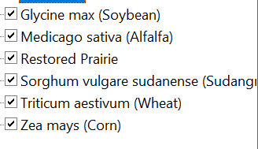
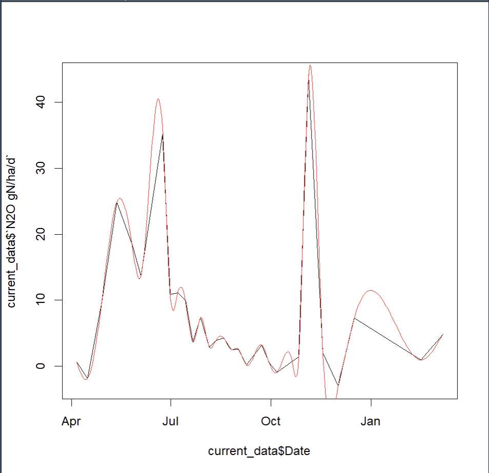

# Report Jun 6 - 12

> Author: Haolin Li
>
> GitHub Repository: https://github.com/HumblePasty/EDF_Proj

## Summary of Progress

### Carbon Input

Available results:

- KBS: **kbs_carbon_input.csv**
- CAP: **cap_carbon_input.csv**
- GraceNET: **gracenet_carbon_input.csv (temporary)**

Columns dictionary:

- identifier columns

  - Year/date

  - Crop/species

  - Treatment information

    - Treatment ID or:

    - Information on the treatment

      - Tillage *pending

        need further instruction for tillage column

      - rotation code, drainage, etc

  - Experiment ID/plotid/SiteID/replication

- Input biomass

- Input Carbon

  - crop
  - cover
  - weedy
  - (other)

### GHG emissions

Available results

- GraceNET: **gracenet_gas_emission.csv**
- CAP: **cap_gas_emission.csv**

Columns dictionary:

- identifier columns
  - Site
  - Experiment/plot id
  - Year/Time range
  - Crop
  - Chamber position
- Numeric columns
  - CO2 flux
  - CO2 standard error
  - CH4 flux
  - CH4 standard error
  - N2O flux
  - N2O standard error
  - NH3 flux (for CAP)
  - NH3 standard error

## Questions So Far

### 1. How to calculate Carbon Input for GraceNET from harvest data

- Harvest data in GraceNET dataset is very detailed in specifying the parts

- Each type of crop has different parts

  - We have:

    

- Different crops have different data availability for these measurements:

  - **Above earshank**: This refers to the parts of the plant above the point where the ear (the part of the plant that contains the seeds, such as corn kernels) is attached to the stalk.

  - **Below earshank**: This refers to the parts of the plant below the point where the ear is attached to the stalk.

  - **Cobs**: The central core of the ear of maize (corn) which holds the kernels.

  - **Grain**: The seeds of the plant, which are harvested for consumption or processing. In the case of maize, this refers to the corn kernels.

  - **Stover (all non-grain biomass)**: This term refers to all parts of the plant excluding the grain. This includes stems, leaves, husks, and tassels.

  - **Stems and leaves**: This refers to both the main stalk (stem) of the plant and its leaves.

  - **Husk**: The leafy outer covering of the ear of maize (corn).

  - **Stems**: The main structural support of the plant, commonly referred to as the stalk in maize.

  - **Leaves**: The green parts of the plant that are involved in photosynthesis.

  - **Tassel**: The male flower of maize that appears at the top of the plant and produces pollen.

  - **Roots**: The underground part of the plant that absorbs water and nutrients from the soil.

Current method: for example for corn

- C_p: use the grain column
- C_s: use stover column
- C_r: Harvest Index estimate
- C_e: multiply C_r by a certain coefficient

### 2. How to Estimate Annual Gas Emission from discrete measurements

- We have measurement on gas emission per day per hectare in certain days

- We need to estimate total emission for a longer period of time

- Current method:

  - Here I used the spline interpolation model

    

  - interpolate values for all days within time range

  - sum and get the total emission

  - not in years, but within a total time frame

### 3. How to integrate gas flux measurements from different chamber positions?

- CAP and GraceNET both specified where the chamber is placed for GHG measurements
- How to integrate different measurements?
- Current method:
  - I kept paralleled results for all chamber positions for CAP
  - I merged all results for GraceNET
