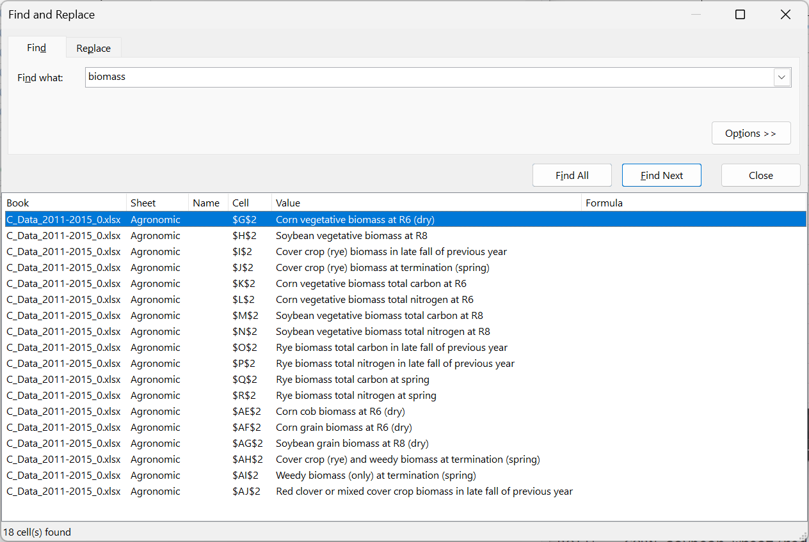

# Log for May 16-17

> Date: May 16-17, 2024
>
> Author: Haolin Li


## Tasks

- Read the ref paper and figure out the principle
- Paper code, run and understand
- For the CAP experiment, try to rep the process
  - find the right columns


## Work log

- paper read

- GitHub Repository created for the project

  - https://github.com/HumblePasty/EDF_Proj

- Replicated NPP calculation process for original site (KBS MSCE)

  - original database upgraded

    The code provided is based on a former version of the dataset. That's why several input files were missing.

  - debugging original code and understanding

- For CAP experiments, I identified the following columns:

### CAP Experiments: Biomass columns

- Site

- Year

- Replicate

- Plot

- Tillage

- Rotation

  - I used this column 

- Species

- Fraction

- **Cover crop biomass measurements (output: cap_biomass_covercrop.csv)**

  - Biomass_cover_crop_fall = AGR06, # 'Cover crop (rye) biomass in late fall of previous year',
  - Biomass_cover_crop_spring = AGR07, # 'Cover crop (rye) biomass at termination (spring)',
  - Biomass_cover_crop_weed_spring = AGR39, # 'Cover crop (rye) and weedy biomass at termination (spring)',
  - Biomass_red_clover_mixed_cover_fall = AGR41, # 'Red clover or mixed cover crop biomass in late fall of previous year',

  **For now I use the Biomass_cover_crop_spring column to represent the cover crop biomass**

- **Crop Biomass measurements (output: cap_biomass_crop.csv)**

  - For corn: 
    - Biomass_corn_vege = AGR04, # 'Corn vegetative biomass at R6 (dry)',
    - Biomass_corn_cob = AGR32, # 'Corn cob biomass at R6 (dry)',
    - Biomass_corn_grain = AGR33, # 'Corn grain biomass at R6 (dry)',
  - For soybean:
    - Biomass_soy_vege = AGR05, # 'Soybean vegetative biomass at R8',
    - Biomass_soy_grain = AGR34, # 'Soybean grain biomass at R8 (dry)',

  **For now I use all of these combined to represent the crop biomass**

- **Weed biomass measurement: (output: cap_biomass_weed.csv)**

  **It is obvious to use Biomass_weed_spring = AGR40, # 'Weedy biomass (only) at termination (spring)'**

  AGR41

- **Compilation of herbaceous systems biomass**

  **There seems to be no corresponding data for this (see question below)**


### Rotations keys (from original dictionary)

```
ROT1 = continuous corn, 
ROT2 = continuous soybean, 
ROT4 = CORN-soybean, 
ROT5 = corn-SOYBEAN, 
ROT6 = CORN-soybean-wheat, 
ROT7 = corn-SOYBEAN-wheat, 
ROT8 = corn-soybean-WHEAT, 
ROT15 = CORN-soybean-wheat/red clover or mixed cover crop, 
ROT16 = corn-SOYBEAN-wheat/red clover or mixed cover crop, 
ROT17 = corn-soybean-WHEAT/RED CLOVER or mixed cover crop, 
ROT18 = CORN-wheat-soybean, 
ROT19 = corn-WHEAT-soybean, 
ROT36 = CORN-soybean with rye cover, 
ROT37 = corn-SOYBEAN with rye cover, 
ROT38 = continuous corn with rye cover, 
ROT39 = continuous soybean with rye cover, 
ROT40 = prairie (managed by cutting 2+/year)
```


## Problems and Questions

To be solved:

- How to integrate fraction into the new 

- Are we considering other biomass input adjustments? (like the one for compilation for herbaceous system in KBS - MCSE)

- What does R6 / R8 means in "Corn vegetative  biomass at R6 (dry)"?

- Explanation needed for all the biomass-related variables

  What does total carbon mean? Should I use these columns instead of the biomass column?

  